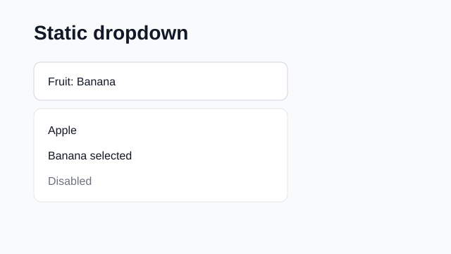
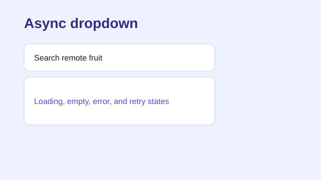
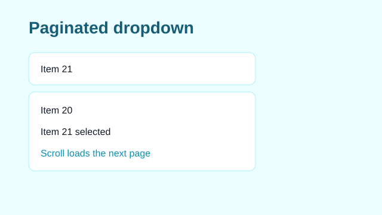
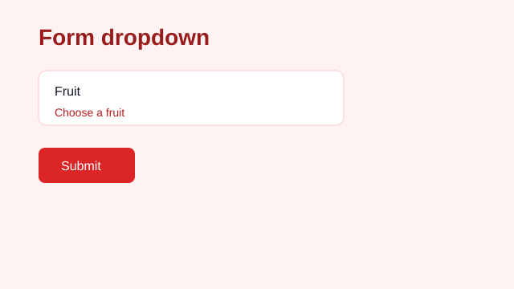
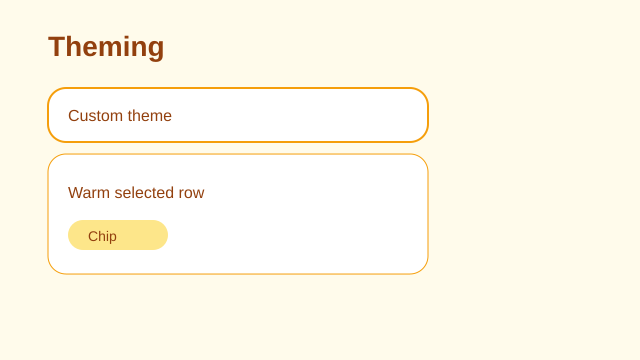
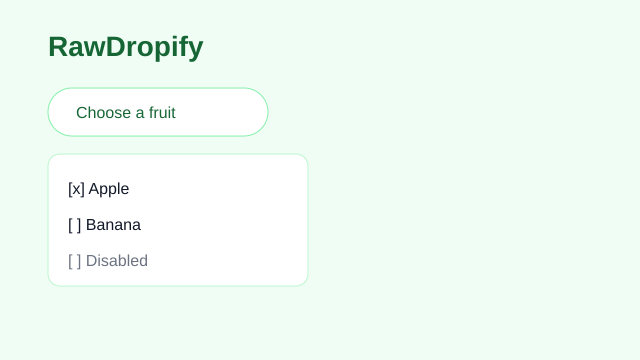

# Dropify Flutter

Dropify is a universal Flutter dropdown package for static lists, debounced async search, paginated results, multi-select chips, raw custom overlays, and `Form` integration through one consistent API.

## Features








- Static, async, and paginated dropdown widgets.
- Single and multi-select modes with value-based selection identity.
- Debounced async queries, retry states, stale-response protection, and pagination footer states.
- `DropifyFormField` for validation, saving, and autovalidation.
- `DropifyTheme` and `DropifyThemeData.fromMaterial(context)` for inherited styling.
- Stable keys for widget and journey tests.

## Install

```yaml
dependencies:
  dropify_flutter: ^0.1.0
```

```dart
import 'package:dropify_flutter/dropify_flutter.dart';
```

## Static

```dart
DropifyDropdown<String>(
  entries: const [
    DropifyEntry(value: 'apple', label: 'Apple'),
    DropifyEntry(value: 'banana', label: 'Banana'),
  ],
  label: 'Fruit',
  onChanged: (value) {},
)
```

## Async

```dart
DropifyAsyncDropdown<String>(
  fetch: (query) async => [
    DropifyEntry(value: query, label: query),
  ],
  label: 'Remote fruit',
  onChanged: (value) {},
)
```

## Paginated

```dart
DropifyPaginatedDropdown<String>(
  firstPageKey: 1,
  pageSize: 20,
  fetchPage: (pageKey, query) async => DropifyPage(
    entries: [DropifyEntry(value: '$pageKey', label: 'Page $pageKey')],
    nextPageKey: pageKey + 1,
  ),
)
```

## Form

```dart
DropifyFormField<String>(
  source: DropifyFormSource.entries(
    entries: const [DropifyEntry(value: 'apple', label: 'Apple')],
  ),
  validator: (value) => value == null ? 'Choose a fruit' : null,
  onSaved: (value) {},
)
```

## Theming

```dart
DropifyTheme(
  data: DropifyThemeData.fromMaterial(Theme.of(context)).copyWith(
    panelMaxHeight: 360,
    panelColor: Theme.of(context).colorScheme.surface,
    panelElevation: 6,
    panelShape: RoundedRectangleBorder(
      borderRadius: BorderRadius.circular(16),
    ),
    panelClipBehavior: Clip.antiAlias,
  ),
  child: DropifyDropdown<String>(entries: entries),
)
```

## Prior Art

Dropify builds on Flutter's `RawMenuAnchor`, `MenuController`, and Material `DropdownMenu` interaction patterns. Its paginated API is inspired by `infinite_scroll_pagination` and common async search flows.

API documentation is available on pub.dev after publishing.
